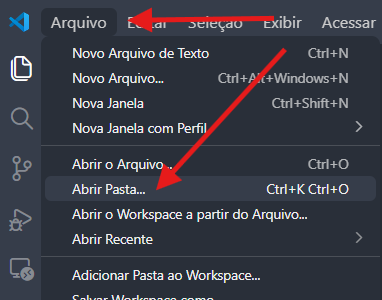

## Projeto 👾

Esse é um recurso para **estudantes**, para terem uma estrutura básica para criar seus projetos com aplicações web, junto da `biblioteca P5.js` pré-integrada, para aqueles que estão familiarizados com a bibloteca.

## Abrindo o Projeto no **VScode** 📁

- Após instalar esse projeto, abra o ***VScode*** e clique em **`"Arquivo"`**, e selecione na janela que for aberta, a opção de **`"Abrir Pasta..."`**.

- Após isso, o **explorador de arquivos** será aberto, e você vai encontrar o caminho da pasta do projeto.

- Quando achar a pasta, clique nela e clique em **`"select folder/selecionar pasta"`**.

- Com isso o ***VScode*** abrirá o projeto para você possa fazer suas alterações livremente.

## Entendo com o Git e o GitHub funcionam 📖

Primeiramente para usar essas ferramentas... você precisa saber o que elas fazem, certo? 

Começando pelo **`git`**, ele servirá para *registrar todas as modificações* que você faz durante o desenvolvimento do projeto. Explicando de forma mais lúdica, o `git` funciona como uma camera, que, a cada coisa que você muda num arquivo ele "tira uma foto", mas como toda camera para conseguir tirar a foto da camera você precisa seguir alguns passos, esses, no caso do `git` são feitos por meio de **comandos**, que serão mostrados mais a frente.

Se o `git` é a camera que tira a foto do seu código, o **`GitHub`** já seria o instagram, já que ele tem como função, **permitir que você poste seu projeto _online_**. Assim você pode publicar ele para que pessoas possam *testar, usar, criar melhorias e também serve de __backup__ em casos que você acabe perdendo seu projeto ou computador*.

## Salvando e publicando o projeto do site com o Git e o GitHub 🚩

Bom agora que você conhece para que servem essas ferramentas, está na hora de você aprender a salvar seu projeto e publicá-lo.

- 1º Passo: abra a pasta de seu projeto pelo ***VScode***, e após isso você notará que na barra esquerda a um simbolo abaixo da lupa com o nome de **_"Controle de Código-Fonte"_**, e quando clicar nele abrirá uma janela como está:

- 2º Passo: ao clicar em **"inicializar repositório"**, o `git` será ativado e começara sua atividade, assim todos os arquivos que foram alterados do seu projetos serão registrados para futuramente serem serem salvos. (**OBS: esse passo só necessário fazer apenas uma vez**).

- 3º Passo: agora para salvar e publicar, primeiro **crie uma conta** no site do `GitHub`, depois de estar logado
